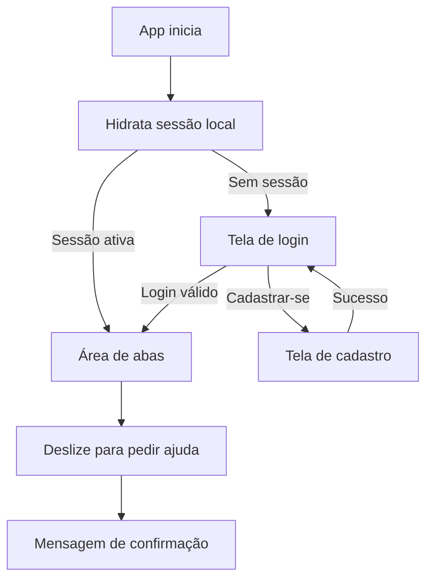

# PDM Security App

Aplicação móvel desenvolvida com Expo + React Native para suporte em cenários de risco, com foco em pedido de ajuda silencioso, autenticação de usuárias e base para monitoramento de contatos ativos e alertas.

## Sumário

- [Visão geral](#visao-geral)
- [Funcionalidades implementadas](#funcionalidades-implementadas)
- [Arquitetura e forma de implementação](#arquitetura-e-forma-de-implementacao)
- [Estrutura de pastas](#estrutura-de-pastas)
- [Tecnologias](#tecnologias)
- [Configuração de ambiente](#configuracao-de-ambiente)
- [Como rodar o projeto](#como-rodar-o-projeto)
- [Credenciais de teste](#credenciais-de-teste)
- [Testes e perfil de qualidade](#testes-e-perfil-de-qualidade)
- [Fluxos principais](#fluxos-principais)
- [Status atual e próximos passos](#status-atual-e-proximos-passos)

## Visão geral

O projeto foi estruturado em camadas para separar interface, regras de negócio e acesso a dados.

- Interface e navegação no padrão Expo Router
- Hooks para encapsular estado e validações de formulários
- Serviços para autenticação, geolocalização e Firebase Firestore
- Store global de sessão com hidratação no bootstrap da aplicação
- Testes unitários e de tela com Jest e Testing Library

## Funcionalidades implementadas

### 1. Autenticação

- Tela de login com entrada por email ou CPF
- Tela de cadastro com nome, CPF, email, telefone, senha e senha de emergência opcional
- Mapeamento de erros de autenticação para mensagens amigáveis
- Persistência local de sessão da usuária com fallback de armazenamento
- Redirecionamento automático para área interna quando sessão já está ativa

Arquivos principais:

- [app/(auth)/sign-in.tsx](app/(auth)/sign-in.tsx)
- [app/(auth)/register.tsx](app/(auth)/register.tsx)
- [src/hooks/auth/useSignIn.ts](src/hooks/auth/useSignIn.ts)
- [src/hooks/auth/useRegister.ts](src/hooks/auth/useRegister.ts)
- [src/services/auth/auth.service.ts](src/services/auth/auth.service.ts)
- [src/store/auth-store.ts](src/store/auth-store.ts)

### 2. Pedido de ajuda por gesto (UI)

- Componente de deslize para acionar pedido de ajuda
- Feedback visual ao concluir o deslize

Arquivos principais:

- [components/SlideToCall.tsx](components/SlideToCall.tsx)
- [app/(tabs)/index.tsx](app/(tabs)/index.tsx)

### 3. Geolocalização

- Solicitação de permissão de localização
- Captura de latitude e longitude
- Reverse geocoding para endereço textual

Arquivo principal:

- [src/services/location.service.ts](src/services/location.service.ts)

### 4. Camada Firebase (base para operação)

- Inicialização condicional via variável de ambiente
- Inicialização do Firebase Auth com persistência no React Native
- Serviço de perfil de usuária
- Serviço de alertas
- Serviço de contatos ativos

Arquivos principais:

- [src/config/firebaseConfig.ts](src/config/firebaseConfig.ts)
- [src/services/firebase/user.service.ts](src/services/firebase/user.service.ts)
- [src/services/firebase/alert.service.ts](src/services/firebase/alert.service.ts)
- [src/services/firebase/activeContacts.service.ts](src/services/firebase/activeContacts.service.ts)

## Arquitetura e forma de implementação

### Estratégia de código

- Navegação por rotas em [app](app)
- Regras de formulário e ação assíncrona em hooks
- Acesso a provedores externos (Firebase, Location) em serviços
- Persistência de autenticação no dispositivo via SecureStore com fallback AsyncStorage (mobile) e localStorage (web)
- Store global baseada em subscribe/snapshot para sincronizar sessão entre telas

### Fluxo técnico de login

1. Tela coleta email/CPF e senha.
2. Hook valida formulário e chama serviço de autenticação.
3. Se a entrada for CPF, o serviço busca email correspondente no Firestore.
4. Autenticação no Firebase Auth.
5. Sessão é persistida no store global com userId e nome.
6. Rota inicial valida sessão hidratada e redireciona para a área interna de abas.

### Fluxo técnico de inicialização do app

1. App abre na rota [app/index.tsx](app/index.tsx).
2. A store hidrata sessão local e expõe estado de carregamento.
3. Se existir sessão, redireciona para [app/(tabs)](app/(tabs)).
4. Se não existir sessão, redireciona para [app/(auth)/sign-in.tsx](app/(auth)/sign-in.tsx).

### Fluxo técnico de cadastro

1. Tela coleta dados de cadastro.
2. Hook valida campos obrigatórios.
3. Cria conta no Firebase Auth.
4. Atualiza displayName.
5. Salva perfil complementar no Firestore.
6. Salva sessão local e retorna sucesso.

## Estrutura de pastas

```text
app/
 index.tsx
 _layout.tsx
 (auth)/
  _layout.tsx
  sign-in.tsx
  register.tsx
 (tabs)/
  _layout.tsx
  index.tsx

src/
 config/
  firebaseConfig.ts
 hooks/
  alert/
   alert.ts
  auth/
   useSignIn.ts
   useRegister.ts
 services/
  auth/
   auth.service.ts
  firebase/
   user.service.ts
   alert.service.ts
   activeContacts.service.ts
  location.service.ts
 store/
  auth-store.ts
 utils/
  dev-log.ts

__tests__/
 app/
  auth/
   sign-in.screen.test.tsx
   register.screen.test.tsx
 unit/
  hooks/
  services/
  utils/
```

## Tecnologias

- Expo SDK 54
- React 19
- React Native 0.81
- Expo Router 6
- Firebase (Auth + Firestore)
- expo-secure-store e @react-native-async-storage/async-storage
- Jest 29 + jest-expo
- Testing Library React Native
- TypeScript

## Configuração de ambiente

Use o arquivo [.env.example](.env.example) como base e crie um arquivo .env na raiz do projeto.

Variáveis esperadas:

- EXPO_PUBLIC_FIREBASE_API_KEY
- EXPO_PUBLIC_FIREBASE_AUTH_DOMAIN
- EXPO_PUBLIC_FIREBASE_PROJECT_ID
- EXPO_PUBLIC_FIREBASE_STORAGE_BUCKET
- EXPO_PUBLIC_FIREBASE_MESSAGING_SENDER_ID
- EXPO_PUBLIC_FIREBASE_APP_ID
- EXPO_PUBLIC_USE_FIREBASE

Observação importante:

- Quando EXPO_PUBLIC_USE_FIREBASE estiver como false, os serviços que dependem de Firebase retornam erro de inicialização (comportamento esperado para evitar chamadas sem configuração).

## Como rodar o projeto

### Pré-requisitos

- Node.js 18+
- npm 9+
- Expo Go no celular (opcional) ou emulador Android/iOS

### 1. Instalar dependências

```bash
npm install
```

### 2. Configurar variáveis de ambiente

Crie .env com base em [.env.example](.env.example).

### 3. Iniciar aplicação

```bash
npx expo start
```

## Credenciais de teste

Para testes manuais de autenticação:

- Usuário: <standard.user@example.com>
- Senha: Senha@123

## Testes e perfil de qualidade

### Comando de testes

```bash
npm run test
```

### Cobertura

```bash
npm run test:coverage
```

O projeto já possui suítes para:

- Hooks de autenticação
  - [__tests__/unit/hooks/useSignIn.test.ts](__tests__/unit/hooks/useSignIn.test.ts)
  - [__tests__/unit/hooks/useRegister.test.ts](__tests__/unit/hooks/useRegister.test.ts)
- Serviços de autenticação e Firebase
  - [__tests__/unit/services/auth.service.test.ts](__tests__/unit/services/auth.service.test.ts)
  - [__tests__/unit/services/firebase/user.service.test.ts](__tests__/unit/services/firebase/user.service.test.ts)
  - [__tests__/unit/services/firebase/alert.service.test.ts](__tests__/unit/services/firebase/alert.service.test.ts)
  - [__tests__/unit/services/firebase/activeContacts.service.test.ts](__tests__/unit/services/firebase/activeContacts.service.test.ts)
- Serviço de localização
  - [__tests__/unit/services/location.service.test.ts](__tests__/unit/services/location.service.test.ts)
- Utilitário de log
  - [__tests__/unit/utils/dev-log.test.ts](__tests__/unit/utils/dev-log.test.ts)
- Testes de tela (auth)
  - [__tests__/app/auth/sign-in.screen.test.tsx](__tests__/app/auth/sign-in.screen.test.tsx)
  - [__tests__/app/auth/register.screen.test.tsx](__tests__/app/auth/register.screen.test.tsx)

Configuração atual de limite global de cobertura no [package.json](package.json):

- branches: 80%
- functions: 80%
- lines: 80%
- statements: 80%

## Fluxos principais



## Status atual e próximos passos

Já implementado:

- Base de autenticação e cadastro
- Integração com Firebase em camada de serviços
- Sessão persistida com store global e hidratação no bootstrap
- Guardas de rota para redirecionamento por sessão ativa
- Captura de localização
- Gesto de pedido de ajuda na interface
- Testes unitários e de tela cobrindo os módulos principais

Evoluções naturais para as próximas iterações:

- Integrar o gesto de SOS ao serviço de alerta real
- Implementar políticas de segurança e criptografia para dados sensíveis
